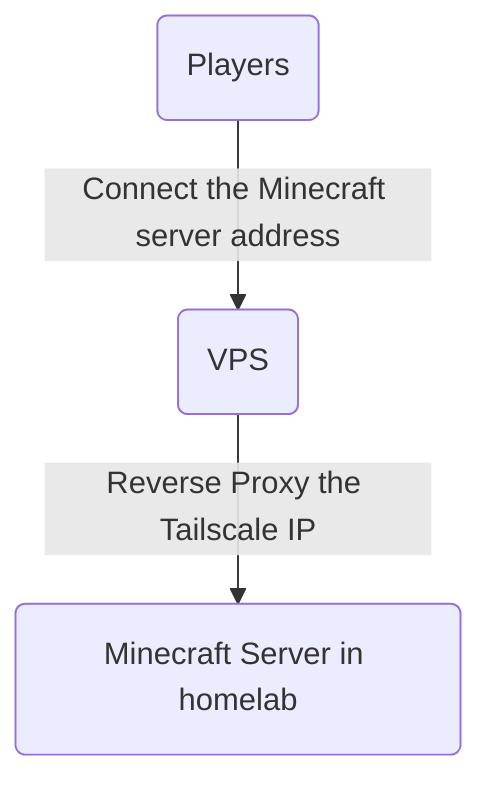

## Context
I want to host a minecraft server with some requirements:
- It has a public address (mc.example.com)
- Hosted at my homelab
- My friend outside my network can join

## Problem
My router don't have a public IP where I can forward to do expose it to do reverse proxy.

## Solution
Tailscale. It's free.

1. Get a VPS with static IP
2. Install Tailscale on both the VPS and your homelab hosting the Minecraft server (Make sure to have MagicDNS turned on for local domain)
3. Both the server must be in the same subnet
4. Reverse proxy the MagicDNS domain from the VPS
5. Point the DNS A record to the VPS

What this does is basically, when the player tries to connect to `mc.example.com` in their Minecraft client, it will fo through that VPS first. The VPS will then proxy that request into your homelab, since it is callable from the same subnet.

## Reverse proxy with Caddy
Make sure to have `Layer4` extension of Caddy for it to support TCP/UDP proxy. Refer [here](https://github.com/mholt/caddy-l4) for installation guide.

This is due to a Minecraft server is not an HTTP server(duh) where you can configure normally. 

Here a snippet of my Caddyfile:

```Caddyfile
{
        debug

        layer4 {
                :25565 {
                        route {
                                proxy {
                                        upstream vm01.homelab.qud:25565
                                }
                        }
                }
        }
}

```
(ffs i hate Caddyfile for using 4 spaces tab instead of 2 like yaml)

So the structure for the whole networking thing would looks something like this:



Tailscale will handle the request from outside into your local subnet. As you can see, I'm using `vm01.homelab.qud` here since i setup my MagicDNS that way. If you are unsure, can just put the Tailscale IP there; it would work just the same.
